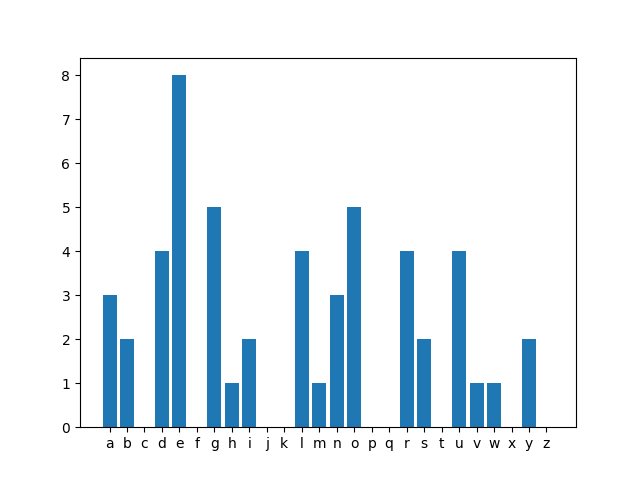

# Scramble Generator #
This repo contains tools to create word scrambles without the user knowing the answers ahead of time.

Category word lists are generated by prompting chatgpt which are then used to generate scrambles.

The scrambles are generated in a way that stochastically minimizes the gini coeficient of the distribution of characters. This makes the scrambles easier and more fun to play

## Usage ##
```
usage: scramble.py [-h] [--category CATEGORY] [--num_words NUM_WORDS]
                   [--min_word_length MIN_WORD_LENGTH] [--max_word_length MAX_WORD_LENGTH]
                   [--num_tile_sets NUM_TILE_SETS] [--category_sets_path CATEGORY_SETS_PATH]
                   [--tile_set_path TILE_SET_PATH] [--scramble_dir SCRAMBLE_DIR]

options:
  -h, --help            show this help message and exit
  --category CATEGORY   Category to create scramble for. Defaults to random category
  --num_words NUM_WORDS
                        Number of words in scramble
  --min_word_length MIN_WORD_LENGTH
                        Minimum word length of words appearing in scramble
  --max_word_length MAX_WORD_LENGTH
                        Minimum word length of words appearing in scramble
  --num_tile_sets NUM_TILE_SETS
                        Multiplier factor for tile set distribution
  --category_sets_path CATEGORY_SETS_PATH
  --tile_set_path TILE_SET_PATH
  --scramble_dir SCRAMBLE_DIR
```
```
usage: chat.py [-h] [--category CATEGORY] [--num_iterations NUM_ITERATIONS]
               [--temperature TEMPERATURE] [--category_sets_path CATEGORY_SETS_PATH]

options:
  -h, --help            show this help message and exit
  --category CATEGORY   Category to add words to. Not specifying this will print the current sets
  --num_iterations NUM_ITERATIONS
                        Number of prompt iterations
  --temperature TEMPERATURE
                        Model temperature. Higher values yield more creative responses
  --category_sets_path CATEGORY_SETS_PATH
```

## Example ##
```bash
export OPENAI_API_KEY="yourkeyhere"
python3 chat.py --category="harry potter characters"
    {}
    100%|███████████████████████████████████████████████████████████████████| 5/5 [00:16<00:00,  3.36s/it]
    {
        "harry potter characters": {
            "num_words": 25,
            "min_length": 3,
            "max_length": 18
        }
    }
python3 scramble.py --category="harry potter characters"
    ---------------------------------------------------------------
    | Category: harry potter characters                           |
    | Answer path: scrambles/harry potter characters_b86de819.txt |
    | Gini Coeficient: 0.556                                      |
    | Characters: {                                               |
    |     "a": 3,                                                 |
    |     "b": 2,                                                 |
    |     "c": 0,                                                 |
    |     "d": 4,                                                 |
    |     "e": 8,                                                 |
    |     "f": 0,                                                 |
    |     "g": 5,                                                 |
    |     "h": 1,                                                 |
    |     "i": 2,                                                 |
    |     "j": 0,                                                 |
    |     "k": 0,                                                 |
    |     "l": 4,                                                 |
    |     "m": 1,                                                 |
    |     "n": 3,                                                 |
    |     "o": 5,                                                 |
    |     "p": 0,                                                 |
    |     "q": 0,                                                 |
    |     "r": 4,                                                 |
    |     "s": 2,                                                 |
    |     "t": 0,                                                 |
    |     "u": 4,                                                 |
    |     "v": 1,                                                 |
    |     "w": 1,                                                 |
    |     "x": 0,                                                 |
    |     "y": 2,                                                 |
    |     "z": 0                                                  |
    | }                                                           |
    ---------------------------------------------------------------
```

